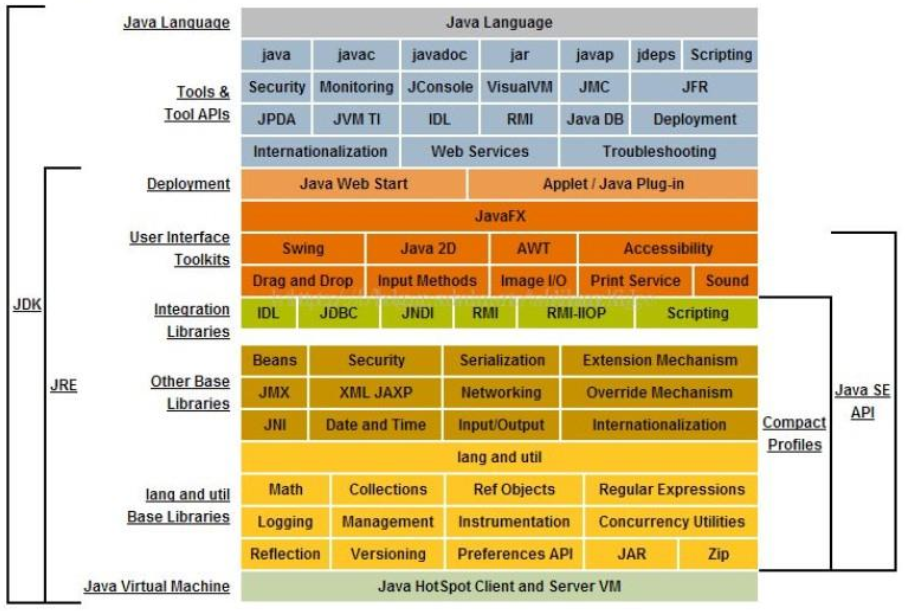
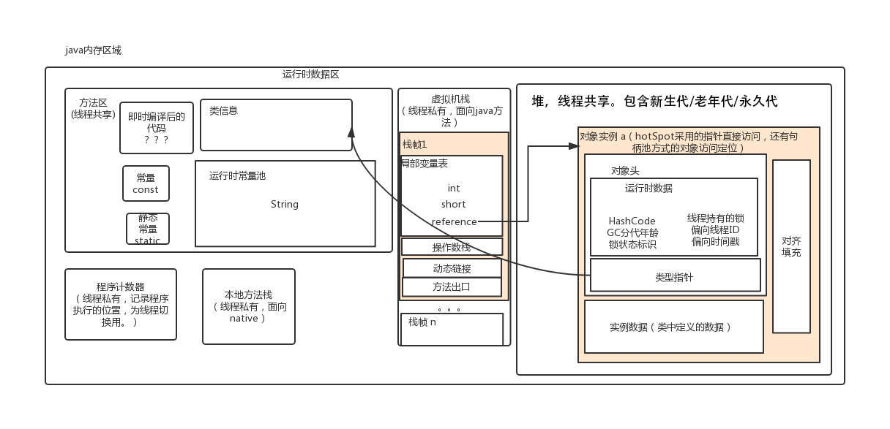
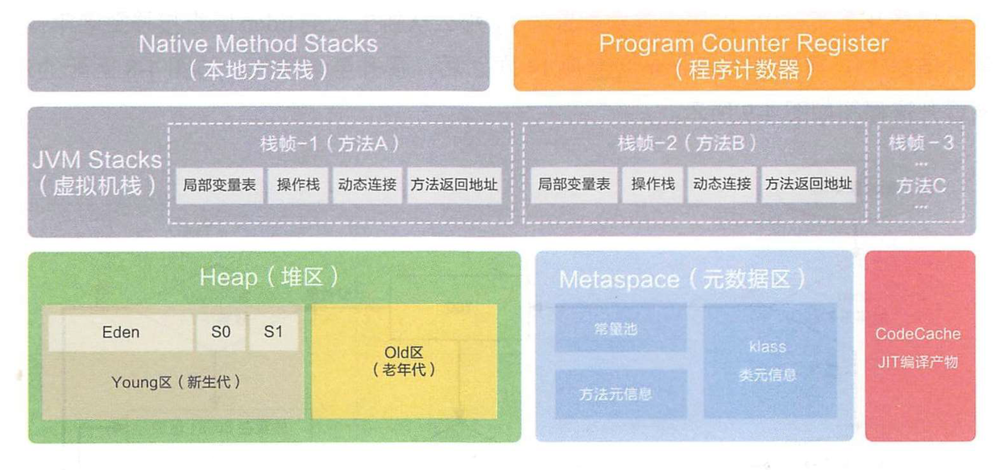

# Java基础

## 认识JDK和JRE

> ### JRE 和 JDK
>
> JRE (Java Runtime Environment) ：是Java程序的运行时环境，包含 JVM 和运行时所需要的 核心类库 。
> JDK (Java Development Kit)：是Java程序开发工具包，包含 JRE 和开发人员使用的工具。
> 我们想要运行一个已有的Java程序，那么只需安装 JRE 即可。
> 我们想要开发一个全新的Java程序，那么必须安装 JDK 。  
>
> 


## 基础语法

### 命名规则

> **标识符**
>
> 指在程序中，我们自己定义内容。比如类的名字、方法的名字和变量的名字等等，都是标识符。

> **命名规则： 硬性要求**
>
> - 标识符可以包含 英文字母26个(区分大小写) 、 0-9数字 、 $（美元符号） 和 _（下划线） 。
> - 标识符不能以数字开头。
> -  标识符不能是关键字。   


>   **命名规范： 软性建议**
>
>   - 类名规范：首字母大写，后面每个单词首字母大写（大驼峰式）。
>   - 方法名规范： 首字母小写，后面每个单词首字母大写（小驼峰式）。
>   - 变量名规范：全部小写。  


### 基本类型

8个基本类型

|数据类型|关键字|内存占用|取值范围|
| ---- | ---- | ---- | ---- |
|字节型|byte|1个字节|-128~127|
|短整型|short|2个字节|-32768~32767|
|整型|int（默认）|4个字节|-2的31次方~2的31次方-1|
|长整型|long|8个字节|-2的63次方~2的63次方-1|
|单精度浮点数|float|4个字节 |1.4013E-45~3.4028E+38|
|双精度浮点数|double（默认）|8个字节|4.9E-324~1.7977E+308|
|字符型|char|2个字节|0-65535|
|布尔类型|boolean|1个字节|true，false|


### 类的概念

**入口函数为：main函数**

```java
$[HelloWorld.java]

public class HelloWorld {
    public static void main(String[] args) {
        System.out.println("Hello World !");
    }
}
```


**类中包括 ：静态代码块，构造方法，成员变量、成员方法、类变量、类方法**

执行顺序为：

​	静态代码 > 构造方法 > 成员方法

​	静态代码 > 类方法

>  静态代码在构造函数 和 本类的main方法之前执行，且只执行一次；可以用做初始化静态数据等工作。
>
> PS：main方法可以认为是一个特殊的类方法


**默认构造**

> 同C++：
>
> 如果你不提供构造方法，系统会给出无参数构造方法。
>
> 如果你提供了构造方法，系统将不再提供无参数构造方法。  

// pure

**抽象类，抽象方法**

> abstract修饰的方法就是抽象方法，抽象方法没有方法体。
>
>  如果一个类存在抽象方法，则这个类为抽象类，需要用**abstract **修饰。
>
> 抽象类不可以实例化对象，需要一个子类继承这个类，实现所有的抽象方法，才能实例对象。

```Java
// abstract修饰的类需要
public abstract class Animal {
	public abstract void run()；
}

public class Cat extends Animal {
    @Override // 标识 方法重写 子类中出现与父类一模一样的方法；（可以用于编译检测）
    public void run() {
        System.out.println("Cat eat ... ");
    }
}
```


成员变量的默认值：

||数据类型|默认值|
| -- |-- |-- |
|基本类型|整数（byte，short，int，long）|0|
||浮点数（float，double）|0.0|
||字符（char）|'\u0000'|
||布尔（boolean）|false|
|引用类型|数组，类，接口|null|


**Demo**:

```java
$[Person.java]
public class Person {
    // 成员变量
    private String name;
    // 类变量
    public static String nation;
    // 静态代码块
    static {
        System.out.println("Person static !");
        nation = "中国";
    }
    // 类方法
    public static String getNation() {
        return nation;
    }
    // main方法
    public static void main(String[] args) {
        System.out.println("Person main running ... ");
        Person person = new Person();
    }
    // 无参构造
    public Person() {
        System.out.println("无参构造");
    }
    // 有参构造
    public Person(String name) {
        System.out.println("有参构造");
        this.name = name;
    }
    // 成员方法
    public String getName() {
        return name;
    }
    public void setName(String name) {
        this.name = name;
    }
}
/*
Person static !
Person main running ... 
无参构造
*/
```

```java
$[Demo.java]
public class Demo {
    public static void main(String[] args) {
        System.out.println("Demo->main方法执行。。。 ");
        Person person1 = new Person();
        Person person2 = new Person("张三", "男", 18);
    }
}
/*
Demo->main方法执行。。。 
Person static !
中国
无参构造
有参构造
*/
```


**JavaBean**

JavaBean 是 Java语言编写类的一种标准规范。符合 JavaBean 的类，要求类必须是具体的和公共的，并且具有无
参数的构造方法，提供用来操作成员变量的 set 和 get 方法。  

```java
public class ClassName{
//成员变量
//构造方法
//无参构造方法【必须】
//有参构造方法【建议】
//成员方法
//getXxx()
//setXxx()
}
```


### 继承

**类继承**

> 关键字：extends，Java是单继承的（这点有别C++）。


**接口实现**

> 关键字： interface（接口）、 implements（实现）
>
> 1. 无法定义成员变量，但是可以定义常量，其值不可以改变，默认使用public static final修饰。
> 2. 没有构造方法，不能创建对象。
> 3. 没有静态代码块。  

**一个类可是实现多个接口**

> 1. 实现所有抽象方法的类才能实例化，如果没没有实例化所有的接口即为抽象类
> 2. 多个接口存在同一个抽象方法，实现一次即可

```java
class 类名 [extends 父类名] implements 接口名1,接口名2,接口名3... {
	// 重写接口中抽象方法【必须】
	// 重写接口中默认方法【不重名时可选】
}
```


**接口之间可以继承**

> 1. 一个接口可以继承一个接口，并添加自己的方法
> 2. 一个接口也可以继承多个接口

```java
public interface 接口名 extends 接口名1,接口名2,接口名3... {
}
```


**默认方法 & 静态方法 **

```java
默认方法：使用 default 修饰，不可省略，供子类调用或者子类重写。
静态方法：使用 static 修饰，供接口直接调用。
public interface InterFaceName {
	public default void method() {
		// 执行语句
	}
	public static void method2() {
		// 执行语句
	}
}
```

> **私有方法和私有静态方法**
> 私有方法：使用 private 修饰，供 **接口中** 的默认方法或者静态方法调用。  


**类型转换  **

**基础类型** ：基础类型之间的转换，如char类型转为int;为**强制转换**

```java
int a = (int) word
```


**向上转型** ：子类类型向父类类型向上转换的过程  ,如用一个父类引用指向一个子类对象  ；为**默认转换**

```java
父类类型 变量名 = new 子类类型();
如：Animal a = new Cat();
```


**向下转型** ：父类类型向子类类型向下转换的过程，  为**强制转换**

```java
子类类型 变量名 = (子类类型) 父类变量名;
如:Cat c =(Cat) a;
```


**判断类型**

向下转型存在危险；

方式一：

用**instanceof** 判断类型。

```java
// 基础类型不能这么处理
if (animal instanceof Cat)
{
    Cat c =(Cat) animal;
}
```

方式二：

用**isInstance** 判断

```java
String str = "abcd";
//自身类.class.isInstance(自身实例或子类实例)  返回true 
System.out.println(String.class.isInstance(str)); //true;
```

方式三：

用**isAssignableFrom**

```java
String str = "abcd";
// 自身类.class.isAssignableFrom(自身类或子类.class)  返回true
System.out.println(String.class.isAssignableFrom(str.getClass())); //true;
```


### this 和super

在Java中我们也会遇到一些问题，如在子类构造中调用父类的构造函数；在子类调用父类的方法；获得当前对象的引用。。

> super ：代表父类的存储空间标识(可以理解为父亲的引用)。
> this ：代表当前对象的引用(谁调用就代表谁)。  


**用法一：访问成员**

```java
this.成员变量 ‐‐ 本类的
super.成员变量 ‐‐ 父类的
this.成员方法名() ‐‐ 本类的
super.成员方法名() ‐‐ 父类的	
```


**用法二：访问成员**

```java
this(...) ‐‐ 本类的构造方法
super(...) ‐‐ 父类的构造方法
```

> 子类的每个构造方法中均有默认的super()，调用父类的空参构造。手动调用父类构造会覆盖默认的super()。
> super() 和 this() 都必须是在构造方法的第一行，所以不能同时出现。  


## 内存

### 内存划分

Java中内存分为5个部分：栈、堆、方法区、本地方法区、寄存器

栈（虚拟机栈）：局部变量，java方法；用完就释放。（java的方法是通过压栈出栈的方执行的）

堆：存储new出来的东西，用完后有垃圾回收器释放。

方法区：主要存 类元数据、常量 等等

本地方法栈：作用同虚拟机栈，提供的是Native方法服务；即提供非Java方法的使用。本地方法可以通过 JNI(Java Native Interface)来访问虚拟机运行时的数据区，甚至可以调用寄存器，具有和 JVM 相同的能力和权限

寄存器：CPU使用的位置。


### Java8前-内存



### Java8后-内存




## 稍微复杂一些的语法

### 内部类

将一个类A定义在另一个类B里面，里面的那个类A就称为内部类，B则称为外部类  

```java
class 外部类 {
	class 内部类{
	}
}
```

**访问特点**

> 内部类可以直接访问外部类的成员，包括私有成员。
> 外部类要访问内部类的成员，必须要建立内部类的对象。  

内部类仍然是一个独立的类，在编译之后会内部类会被编译成独立的.class文件，但是前面冠以外部类的类名
和  $ 符号 。

比如，Person$Leg.class  

```java
public class Person {
	private boolean live;

    public class Leg {
        public void run() {
            if (live) {
                System.out.println("running .... ");
            } else {
                System.out.println("dead");
            }
        }
    }

    public Person() {
        this.live = true;
    }

    public Person(boolean live) {
        this.live = live;
    }

    public boolean isLive() {
        return live;
    }

    public void setLive(boolean live) {
        this.live = live;
    }
}
```

```Java
public class Demo {
    public static void main(String[] args) {
        Person person = new Person();
        Person.Leg leg1 = person.new Leg();
        leg1.run();
    }
}
```


### 匿名内部类

内部类的简化写法。它的本质是一个 **带具体实现的 ** **父类或者父接口的**  匿名的 **子类对象**。
开发中，最常用到的内部类就是匿名内部类了。

>  要素：
>
> 1. 父类 或 父接口
> 2. 子类实现

```java
new 父类名或者接口名(){
    // 方法重写
    @Override
    public void method() {
    // 执行语句
    }
};  
```

```java
public interface Eat {
    public abstract void eat();
}

public class Demo {
    public static void main(String[] args) {
        Eat eat = new Eat() {
            @Override
            public void eat() {
                System.out.println("eat fruit");
            }
        };
        eat.eat();
    }
}
```


## JUnit单元测试

	* 测试分类：
		1. 黑盒测试：不需要写代码，给输入值，看程序是否能够输出期望的值。
		2. 白盒测试：需要写代码的。关注程序具体的执行流程。
	
	* Junit使用：白盒测试
		* 步骤：
			1. 定义一个测试类(测试用例)
				* 建议：
					* 测试类名：被测试的类名Test		CalculatorTest
					* 包名：xxx.xxx.xx.test		cn.itcast.test
	
			2. 定义测试方法：可以独立运行
				* 建议：
					* 方法名：test测试的方法名		testAdd()  
					* 返回值：void
					* 参数列表：空参
	
			3. 给方法加@Test
			4. 导入junit依赖环境
	
		* 判定结果：
			* 红色：失败
			* 绿色：成功
			* 一般我们会使用断言操作来处理结果
				* Assert.assertEquals(期望的结果,运算的结果);
	
		* 补充：
			* @Before:
				* 修饰的方法会在测试方法之前被自动执行
			* @After:
				* 修饰的方法会在测试方法执行之后自动被执行

## 反射：框架设计的灵魂

	* 框架：半成品软件。可以在框架的基础上进行软件开发，简化编码
	* 反射：将类的各个组成部分封装为其他对象，这就是反射机制
		* 好处：
			1. 可以在程序运行过程中，操作这些对象。
			2. 可以解耦，提高程序的可扩展性。


	* 获取Class对象的方式：
		1. Class.forName("全类名")：将字节码文件加载进内存，返回Class对象
			* 多用于配置文件，将类名定义在配置文件中。读取文件，加载类
		2. 类名.class：通过类名的属性class获取
			* 多用于参数的传递
		3. 对象.getClass()：getClass()方法在Object类中定义着。
			* 多用于对象的获取字节码的方式
	
		* 结论：
			同一个字节码文件(*.class)在一次程序运行过程中，只会被加载一次，不论通过哪一种方式获取的Class对象都是同一个。


	* Class对象功能：
		* 获取功能：
			1. 获取成员变量们
				* Field[] getFields() ：获取所有public修饰的成员变量
				* Field getField(String name)   获取指定名称的 public修饰的成员变量
	
				* Field[] getDeclaredFields()  获取所有的成员变量，不考虑修饰符
				* Field getDeclaredField(String name)  
			2. 获取构造方法们
				* Constructor<?>[] getConstructors()  
				* Constructor<T> getConstructor(类<?>... parameterTypes)  
	
				* Constructor<T> getDeclaredConstructor(类<?>... parameterTypes)  
				* Constructor<?>[] getDeclaredConstructors()  
			3. 获取成员方法们：
				* Method[] getMethods()  
				* Method getMethod(String name, 类<?>... parameterTypes)  
	
				* Method[] getDeclaredMethods()  
				* Method getDeclaredMethod(String name, 类<?>... parameterTypes)  
	
			4. 获取全类名	
				* String getName()  


	* Field：成员变量
		* 操作：
			1. 设置值
				* void set(Object obj, Object value)  
			2. 获取值
				* get(Object obj) 
	
			3. 忽略访问权限修饰符的安全检查
				* setAccessible(true):暴力反射
	
	* Constructor:构造方法
		* 创建对象：
			* T newInstance(Object... initargs)  
	
			* 如果使用空参数构造方法创建对象，操作可以简化：Class对象的newInstance方法


	* Method：方法对象
		* 执行方法：
			* Object invoke(Object obj, Object... args)  
	
		* 获取方法名称：
			* String getName:获取方法名
