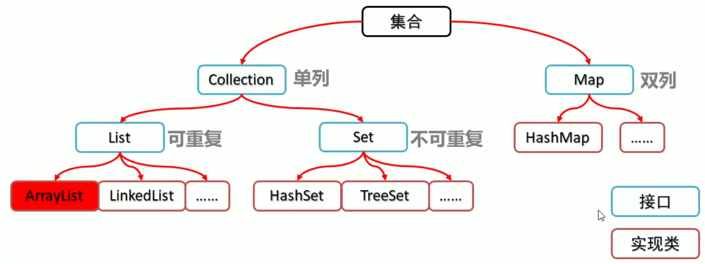
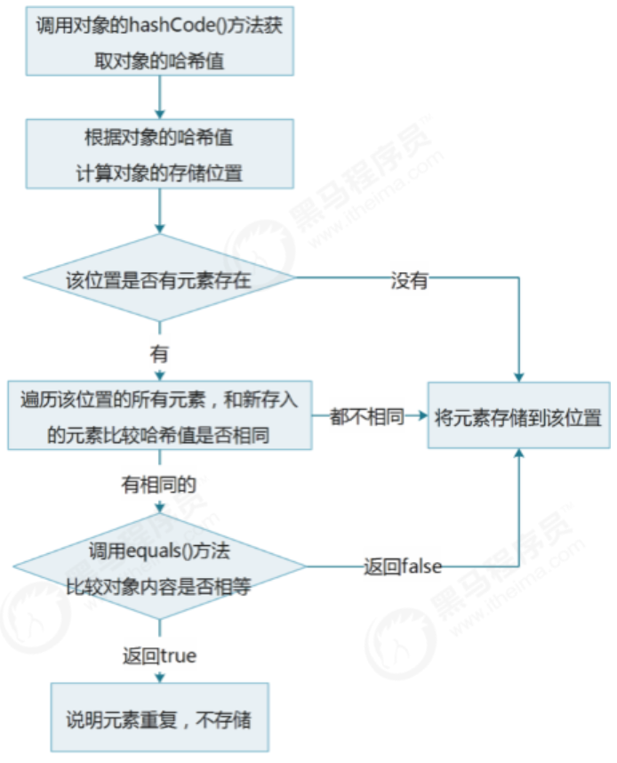

# Collection 集合

## 1 集合体系结构

- 集合类的特点

  提供一种存储空间可变的存储模型，存储的瓣容量可以随时发生改变

- 集合类的体系图



  

 

## 2 Collection集合概述和基本使用

- Collection集合概述
  - 是单例集合的顶层接口 ,它表示一组对象,这些对象也称为Collection的元素
  - JDK不提供此接口的任何直接实现,它提供更具体的子接口(如Set和List)实现

- Collection集合基本使用

```java
public class CollectionDemo {
    public static void main(String[] args) {
        //创建collection集合的对象
        Collection<String> c = new ArrayList<String>();
        //添加元素：boolean add(E e)
        c.add("hello");
        c.add("worid");
        c.add("java");
        //输出集合对象
        System.out.println(c);
    }
}
```


## 3 Collection集合的常用方法

| **方法名**                 | **说明**                          |
| -------------------------- | --------------------------------- |
| boolean add(E e)           | 添加元素                          |
| boolean remove(Object o)   | 从集合中移除指定的元素            |
| void clear()               | 清空集合中的元素                  |
| boolean contains(Object o) | 判断集合中是否 g 旨定的元素       |
| boolean isEmpty()          | 判断集合是否为空                  |
| int size()                 | 集合的长度,也就是集合中元素的个数 |

 

## 4 Collection集合的遍历

- 迭代器的介绍
  - 迭代器,集合的专用
  - Iterator iterator():返回此集合中元素的迭代器,通过集合的iterator。方法得到
  - 迭代器是通过集合的iterator。方法得到的,所以我们说它是依赖于集合而存在的

- Collection集合的遍历

```java
public class IteratorDemo {
    public static void main(String[] args) {
        //创建集合对象
        Collection<String> c = new ArrayList<String>();
        //添加元素
        c.add("hello");
        c.add("world");
        c.add("java");
        c.add("javaee");

        //Iterator<E> iterator():返回此集合中兀素的迭代器,通过集合的iterator()方法得到
        Iterator<String> it = c.iterator();
        //用whi1e循环改进元素的判断和获取
        while (it.hasNext()) {
            String s =it.next();
            System.out.println(s);
        }
    }
}
```

 

# list集合

## 1 List集合概述和特点

- List集合概述
  - 有序集合（也称为序列），用户可以精确控制列表中每个元素的插入位置。用户可以通过整数索引访问元 素,并搜索列表中的元素
  - 与Set集合不同，列表通常允许重复的元素

- List集合特点
  - 有索引
  - 可以存储重素
  - 元素存取有序

## 2 List集合的特有方法

| **方法名**                     | **描述**                               |
| ------------------------------ | -------------------------------------- |
| void add(int index, E element) | 在此集合中的指定位置插/M旨定的元素     |
| E remove(int index)            | 删除指定索引处的元素,返回被删除的元素  |
| E set(int index, E element)    | 修改J旨定索引处的元素,返回被修改的元素 |
| E get(int index)               | 返回指定索引处的元素                   |


## 3 List集合子类的特点

- ArrayList 集合
  - 底层是数组结构实现,查询快、增删慢

- LinkedList集合
  - 底层是链表结构实现,查询慢、增删快
  - 特有方法

| **LinkedList 特有方法 方法名** | **说明**                         |
| ------------------------------ | -------------------------------- |
| public void addFirst(E e)      | 在该列券头插涌定的元素           |
| public void addLast(E e)       | 樹旨定的元素斷到此列表的末尾     |
| public E getFirst()            | 返回此列表中的第一个元素         |
| public E getLast()             | 返回此列表中的最后一个元素       |
| public E removeFirst()         | 从此列表中删除并返回第一个元素   |
| public E removeLast()          | 从此列表中删除并返回最后一个元素 |

 

## 4 集合的案例-List集合存储学生对象并遍历

- 案例需求  

  创建一个存储学生对象的集合,存储3个学生对象,使用程序实现在控制台遍历该集合  

- 代码实现  

  ```java
  public class Student {
      private String name;
      private int age;
      public Student(){
  
      }
      public Student(String name,int age){
          this.name=name;this.age=age;
      }
      public String getName(){
          return name;
      }
      public void setName(String name){
          this.name=name;
      }
      public int getAge(){
          return age;
      }
      public void setAge(int age){
          this.age=age;
      }
  }
  ```

  

- 测试类  

  ```java
  public class ListDemo {
      public static void main(String[] args) {
  
          //创建List集合对象
          List<Student> list=new ArrayList<Student>();
  
          //创建学生对象
          Student s1 = new Student("林青霞",30);
          Student s2 = new Student("张曼玉",35);
          Student s3 = new Student("王祖贤",33);
  
          //把学生添加到集合
          list.add(s1);
          list.add(s2);
          list.add(s3);
  
          //迭代器方式
          Iterator<Student> it=list.iterator();
          while (it.hasNext()) {
              Student s = it.next();
              System.out.println(s.getName()+","+s.getAge());
          }
  
          System.out.println("--------");
  
          //for循环方式
          for(int i=0; i < list.size(); i++) {
              Student s = list.get(i);
              System.out.println(s.getName()+","+s.getAge());
          }
      }
  }
  
  ```
  

## 5 并发修改异常

- 出现的原因
  
  - 迭代器遍历的过程中，通过集合对象修改了集合中的元素，造成了迭代器获取元素中判断预期修改值和实际修改值不一致，则会出现：ConcurrentModificationException
- 解决的方案
  - 用for循环遍历,然后用集合对象做对应的操作即可
  - 使用列表迭代器ListIterator
    - 通过List集合的listlterator()方法得到,所以说它是Li st集合特有的迭代器
    - 用于允许程序员沿任一方向遍历的列表迭代器,在迭代期间修改列表,并获取列表中迭代器的当前位置
- 示例代码

```java
public class ListDemo2 {
    public static void main(String[] args) {
        // 创建集合对象
        List<String> list = new ArrayList<>();

        // 添加元素
        list.add("hello");
        list.add("world");

        //迭代器方式
        Iterator<String> it=list.iterator();
        while (it.hasNext()) {
            String s = it.next();
            if (s.equals("world")) {
                //list.add("java");  //ConcurrentModificationException
            }
        }

        // for循环方式
        for(int i=0; i < list.size(); i++) {
            String s = list.get(i);
            if (s.equals("world")) {
                list.add("java");
            }
        }

        //获取列表迭代器
        ListIterator<String> lit = list.listIterator();
        while (lit.hasNext()) {
            String s = lit.next();
            if(s.equals("world")) {
                lit.add("javaee");
            }
        }

        // 输出集合对象
        System.out.println(list);
    }
}

```


## 6 增强for循环

- 定义格式
	``` java
	for(元素数据类型变量名:数组/集合对象名){
	循环体;
	}
	```

- 示例代码
    ```java
    public class ForDemo {
        public static void main(String[] args) {
            int[] arr = {1, 2, 3, 4, 5};
            for (int i : arr) {
                System.out.println(i);
            }
            System.out.println("--------");

            String[] strArray = {"hello", "world", "java"};
            for (String s : strArray) {
                System.out.println(s);
            }
            System.out.println("--------");

            List<String> list = new ArrayList<String>();
            list.add("hello");
            list.add("world");
            list.add("java");
            for (String s : list) {
                System.out.println(s);
            }
            System.out.println("--------");

            // 内部原理是一个Iterator迭代器
            for(String s : list) {
                if(s.equals("world")) {
            //        list.add("javaee"); //ConcurrentModificationException
                }
            }
        }
    }
    ```


# Set集合

## 1 Set集合概述和特点
- Set集合的特点
   - 元素存取无序
   - 没有索引、只能通过迭代器或增强for循环遍历
   - 不能存储重复元素  

## 2 Java哈希值
- 哈希值简介
   - 是JDK根据对象的地址或者字符串或者数字算出来的int类型的数值
- 如何获取哈希值
   - Object类中的 public int hashCode()：返回对象的哈希码值
- 哈希值的特点
   - 同一个对象多次调用 hashCode() 方法，返回的哈希值是相同的
   - 默认情况下，不同对象的哈希值是不同的。而重写hashCode()方法，可以实现让不同对象的哈希值相同  


## 3 HashSet集合概述和特点

- HashSet集合的特点
	- 底层数据结构是哈希表
	- 对集合的迭代顺序不作任何保证，也就是说不保证存储和取出的元素顺序一致
    - 没有带索引的方法，所以不能使用普通for循环遍历
    - 由于是Set集合，所以是不包含重复元素的集合  
    - HashSet存储逻辑：
        
  
- 案例需求
  - 创建一个存储学生对象的集合，存储多个学生对象，使用程序实现在控制台遍历该集合
  - 要求：学生对象的成员变量值相同，我们就认为是同一个对象  
- 学生类：
    ```java
    public class Student {
        private String name;
        private int age;
    
        public Student() {
        }
    
        public Student(String name, int age) {
            this.name = name;
            this.age = age;
        }
    
        public String getName() {
            return name;
        }
    
        public void setName(String name) {
            this.name = name;
        }
    
        public int getAge() {
            return age;
        }
    
        public void setAge(int age) {
            this.age = age;
        }
    
        @Override
        public boolean equals(Object o) {
            if (this == o)
                return true;
    
            if (o == null || getClass() != o.getClass())
                return false;
    
            Student student = (Student) o;
    
            if (age != student.age)
                return false;
    
            return name != null ? name.equals(student.name) : student.name == null;
        }
    
        @Override
        public int hashCode() {
            int result = name != null ? name.hashCode() : 0;
            result = 31 * result + age;
            return result;
        }
    }
    ```

- 测试类
    ```java
    public class HashSetDemo {
        public static void main(String[] args) {
            //创建HashSet集合对象
            HashSet<Student> hs = new HashSet<Student>();
            //创建学生对象
            Student s1 = new Student("林青霞", 30);
            Student s2 = new Student("张曼玉", 35);
            Student s3 = new Student("王祖贤", 33);
            Student s4 = new Student("王祖贤", 33);
            Student s5 = new Student("", 33);
            Student s6 = new Student("", 33);
            //把学生添加到集合
            hs.add(s1);
            hs.add(s2);
            hs.add(s3);
            hs.add(s4);
            hs.add(s5);
            hs.add(s6);
            hs.add(new Student());
            hs.add(new Student());
            //遍历集合(增强for)
            for (Student s : hs) {
                System.out.println(s.getName() + "," + s.getAge());
            }
        }
    }
    ```


## 4 LinkedHashSet集合概述和特点

- LinkedHashSet集合特点
  - 哈希表和链表实现的Set接口，具有可预测的迭代次序
  - 由链表保证元素有序，也就是说元素的存储和取出顺序是一致的
  - 由哈希表保证元素唯一，也就是说没有重复的元素  

- 测试类

  ```java
  public class LinkedHashSetDemo {
      public static void main(String[] args) {
          //创建集合对象
          LinkedHashSet<String> linkedHashSet = new LinkedHashSet<String>();
          //添加元素
          linkedHashSet.add("hello");
          linkedHashSet.add("world");
          linkedHashSet.add("java");
          linkedHashSet.add("world");
          //遍历集合
          for(String s : linkedHashSet) {
              System.out.println(s);
          }
      }
  }
  ```

  


## 5 TreeSet集合概述和特点

- TreeSet集合概述
  - 元素有序，可以按照一定的规则进行排序，具体排序方式取决于构造方法
    - TreeSet(Comparator comparator) ：根据指定的比较器进行排序
    - TreeSet()：根据其元素的自然排序进行排序
  - 没有带索引的方法，所以不能使用普通for循环遍历
  - 由于是Set集合，所以不包含重复元素的集合  

- 案例需求
  - 存储学生对象并遍历
  - 要求：按照年龄从小到大排序，年龄相同时，按照姓名的字母顺序排序


### 5.1 比较器排序Comparator

```java
public class TreeSetDemo {
    public static void main(String[] args) {
        // 创建集合对象
        TreeSet<Student> ts = new TreeSet<Student>(new Comparator<Student>() {
            @Override
            public int compare(Student o1, Student o2) {
                int num = o1.getAge() - o2.getAge();
                int num2 = num == 0 ? o1.getName().compareTo(o2.getName()) : num;
                return num2;
            }
        });

        //把学生添加到集合
        ts.add(new Student("xishi", 29));
        ts.add(new Student("wangzhaojun", 28));
        ts.add(new Student("diaochan", 30));
        ts.add(new Student("yangyuhuan", 33));
        ts.add(new Student("linqingxia",33));
        ts.add(new Student("linqingxia",33));

        //遍历集合
        for (Student s : ts) {
            System.out.println(s.getName() + "," + s.getAge());
        }
    }
}
```

### 5.2 自然排序Comparable

- 学生类

  ```java
  public class Student2 implements Comparable<Student2> {
      private String name;
      private int age;
  
      public Student2() {
      }
  
      public Student2(String name, int age) {
          this.name = name;
          this.age = age;
      }
  
      public String getName() {
          return name;
      }
  
      public void setName(String name) {
          this.name = name;
      }
  
      public int getAge() {
          return age;
      }
  
      public void setAge(int age) {
          this.age = age;
      }
  
      @Override
      public int compareTo(Student2 student2) {
          int num = this.getAge() - student2.getAge();
          int num2 = num == 0 ? this.getName().compareTo(student2.getName()) : num;
          return num2;
      }
  }
  ```

- 测试类

  ```java
  public class TreeSetDemo2 {
      public static void main(String[] args) {
          //创建集合对象
          TreeSet<Student2> ts = new TreeSet<Student2>();
          //把学生添加到集合
          ts.add(new Student2("xishi", 29));
          ts.add(new Student2("wangzhaojun", 28));
          ts.add(new Student2("diaochan", 30));
          ts.add(new Student2("yangyuhuan", 33));
          ts.add(new Student2("linqingxia",33));
          ts.add(new Student2("linqingxia",33));
          //遍历集合
          for (Student2 s : ts) {
              System.out.println(s.getName() + "," + s.getAge());
          }
      }
  }
  ```

  

# Map集合

## 1 Map集合概述和特点

- Map集合概述

  ```java
   interface Map<K,V> K：键的类型；V：值的类型
  ```

  

- Map集合的特点

  - 键值对映射关系
  - 一个键对应一个值
  - 键不能重复，值可以重复
  - 元素存取无序  

- 基本方法介绍  

	| 方法名                              | 说明                         |
	| -------------------------- | -------------------------------|
	| V put(K key,V value)                | 添加元素            |
	| V remove(Object key)                | 根据键删除键值对元素   |
	| void clear()                        | 移除所有的键值对元素   |
	| boolean containsKey(Object key)     | 判断集合是否包含指定的键  |
	| boolean containsValue(Object value) | 判断集合是否包含指定的值 |
	| boolean isEmpty()                   | 判断集合是否为空   |
	| int size()             | 集合的长度，也就是集合中键值对的个数 |

- 获取方法

  | 方法名                         | 说明                     |
  | ----------| ------------------------ |
  | V get(Object key)              | 根据键获取值             |
  | Set keySet()                   | 获取所有键的集合         |
  | Collection values()            | 获取所有值的集合         |
  | Set<Map.Entry<K,V>> entrySet() | 获取所有键值对对象的集合 |

  

##  2  遍历Map

- Set<K> keySet()，获取所有键的集合。
- Set<Map.Entry<K,V>> entrySet()，获取所有键值对对象的集合 。

```java
public class MapDemo {
    public static void main(String[] args) {
        //创建集合对象
        Map<String, String> map = new HashMap<String, String>();

        //添加元素
        map.put("张无忌", "赵敏");
        map.put("郭靖", "黄蓉");
        map.put("杨过", "小龙女");

        //获取所有键的集合。用keySet()方法实现
        Set<String> keySet = map.keySet();

        //遍历键的集合，获取到每一个键。用增强for实现
        for (String key : keySet) {
            //根据键去找值。用get(Object key)方法实现
            String value = map.get(key);
            System.out.println(key + "," + value);
        }

        System.out.println("-----------------------------");
        
        //获取所有键值对对象的集合
        Set<Map.Entry<String, String>> entries = map.entrySet();

        //遍历键值对对象的集合，得到每一个键值对对象
        for (Map.Entry<String, String> me : entries) {
            //根据键值对对象获取键和值
            String key = me.getKey();
            String value = me.getValue();
            System.out.println(key + "," + value);
        }
    }
}
```


## 3 Properties特点

- Properties介绍

  - 是一个Map体系的集合类
  - Properties可以保存到流中或从流中加载
  - 属性列表中的每个键及其对应的值都是一个字符串  

- 特有方法  

  | 方法名                                       | 说明                                                         |
  | -------------------------------------------- | ------------------------------------------------------------ |
  | Object setProperty(String key, String value) | 设置集合的键和值，都是String类型，底层调用 Hashtable方法 put |
  | String getProperty(String key)               | 使用此属性列表中指定的键搜索属性                             |
  | Set stringPropertyNames()                    | 从该属性列表中返回一个不可修改的键集，其中键及其对应的 值是字符串 |

- 示例代码

```java
public class PropertiesDemo1 {
    public static void main(String[] args) {
        //创建集合对象
        Properties prop = new Properties();

        //存储元素
        prop.put("001", "林青霞");
        prop.put("002", "张曼玉");
        prop.setProperty("003", "王祖贤");

        //遍历集合
        Set<String> keySet = prop.stringPropertyNames();
        for (String key : keySet) {
            String value = prop.getProperty(key);
            System.out.println(key + "," + value);
        }
    }
}
```

#### 3.1 Properties和IO流相结合的方法

- 和IO流结合的方法  

| 方法名                                        | 说明                                                         |
| --------------------------------------------- | ------------------------------------------------------------ |
| void load(InputStream inStream)               | 从输入字节流读取属性列表（键和元素对）                       |
| void load(Reader reader)                      | 从输入字符流读取属性列表（键和元素对）                       |
| void store(OutputStream out, String comments) | 将此属性列表（键和元素对）写入此 Properties表中，以适合于使用 load(InputStream)方法的格式写入输出字节流 |
| void store(Writer writer, String comments)    | 将此属性列表（键和元素对）写入此 Properties表中，以适合使用 load(Reader) |

- 示例代码

```java

public class PropertiesDemo2 {
    public static void main(String[] args) throws IOException {
        PropertiesDemo2 demo = new PropertiesDemo2();
        //把集合中的数据保存到文件
        demo.myStore();
        //把文件中的数据加载到集合
        demo.myLoad();
    }

    private void myLoad() throws IOException {
        Properties prop = new Properties();
        FileReader fr = new FileReader(this.getClass().getResource("/Stream/fw.txt").getPath());
        prop.load(fr);
        // 也可以
        //prop.load(this.getClass().getResourceAsStream("/Stream/fw.txt"));
        fr.close();
        System.out.println(prop);
    }

    private void myStore() throws IOException {
        Properties prop = new Properties();
        prop.setProperty("001", "林青霞");
        prop.setProperty("002", "张曼玉");
        prop.setProperty("003", "王祖贤");

        FileWriter fw = new FileWriter(this.getClass().getResource("/Stream/fw.txt").getPath());
        prop.store(fw, null);
        fw.close();
    }
}
```

