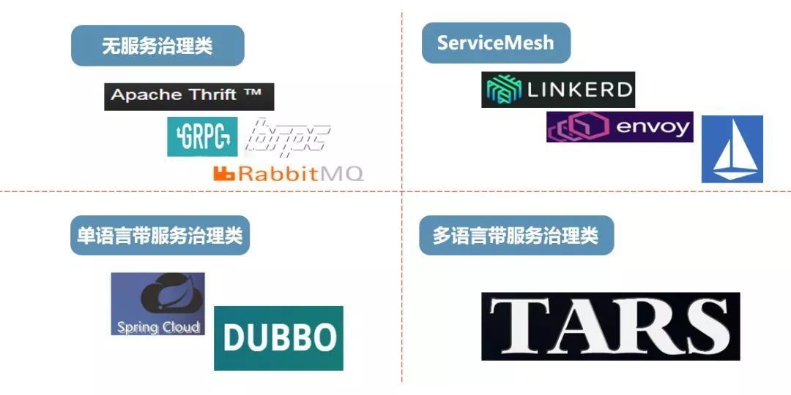

# Go语言微服务比较

## go-kit 是什么

> [手把手带你使用 go-kit（基础篇） - Binb - 博客园 (cnblogs.com)](https://www.cnblogs.com/binHome/p/13927942.html#:~:text=go-kit 是什么. Go,kit 是一个微服务工具包集合。. 利用它提供的额API和规范可以创建健壮、可维护性高的微服务体系.) ：Go kit 是一个微服务工具包集合。利用它提供的额API和规范可以创建健壮、可维护性高的微服务体系。
>
> [Go-kit 微服务入门指南 - 简书 (jianshu.com)](https://www.jianshu.com/p/cffe039fa060) : go-kit本身不是一个框架，而是一套微服务工具集, 它可以用来解决分布式系统开发中的大多数常见问题. 所以你可以专注于你的业务逻辑中.
>
> [Go 教程：Go Kit 微服务实战 - 知乎 (zhihu.com)](https://zhuanlan.zhihu.com/p/100226931?utm_source=wechat_session) : Go kit 是用于在 Go 中构建微服务的编程工具包。我们解决了分布式系统和应用程序体系结构中的常见问题，因此您可以专注于交付业务价值。

## Goa是什么

> [通过基于Go的微服务框架goa，实现对服务API的定义、审查与实现-InfoQ](https://www.infoq.cn/news/2016/01/goa-microservice-framework/) : Raphael Simon 是来自于 RightScale 的一位高级系统架构师，他创建了一种基于 Go 语言的 HTTP 微服务框架，名为[“goa”](https://github.com/raphael/goa)。这一框架允许开发者通过[领域特定语言](https://blog.gopheracademy.com/advent-2015/goaUntanglingMicroservices/#the-goa-design-language%3aafc981c9e4e4f16285e6c92cad288452)（DSL）定义服务的API，并且通过自动代码生成功能创建“样板”式的服务端和客户端代码以及文档。

## Dubbogo是什么

>  [dubbo-go-one-year (dubbogo.github.io)](https://dubbogo.github.io/dubbo-go-website/zh-cn/blog/dubbo-go-one-year.html#:~:text=Dubbo-go 是 Dubbo 的完整 Go 语言实现，在功能实现和技术路径上与 Dubbo 有不同程度的对标，项目团队预计很快便可以追平,Java 版的功能。 当然，也是因为基于 Go 语言开发，Dubbo-go 更易上手，未来或将反哺 Dubbo 的云原生化。) : Dubbo-go 是 Dubbo 的完整 Go 语言实现，在功能实现和技术路径上与 Dubbo 有不同程度的对标，项目团队预计很快便可以追平 Java 版的功能。

### Dubbo 是什么

> [Dubbo - 简书 (jianshu.com)](https://www.jianshu.com/p/3090d63e9cb3) ：Dubbo是阿里巴巴开源的基于 Java 的高性能 RPC（一种远程调用） 分布式服务框架（SOA），致力于提供高性能和透明化的RPC远程服务调用方案，以及SOA服务治理方案。
>
> 因为是阿里开源项目，国内很多互联网公司都在用，已经经过很多线上考验。内部使用了 Netty、Zookeeper，保证了高性能高可用性。

## Tars-Go是什么

> [支持多语言的微服务框架Tars-Go - Go语言编程 (gobea.cn)](https://gobea.cn/blog/detail/RoRDnlr3.html) : TARS支持C++、Java、Nodejs、PHP、Golang等多种开发语言，并配套服务治理平台，帮助开发人员和企业快速构建稳定可靠的分布式微服务应用，从而令开发人员只关注逻辑，提高研发和运营效率，缩短产品研发时间，加快产品创新的节奏。TARS在腾讯经过10多年的大规模使用和迭代，广泛应用于腾讯核心业务中；自开源以来，有上百家企业上万名开发者在使用，涵盖即时通讯、直播、视频、游戏、金融、交通、IoT等多个行业。
>
> TarsGo 是TARS的Go语言实现版本，目前已完全开源，项目地址：https://github.com/TarsCloud/TarsGo，欢迎star~！

比较出名的微服务框架比较：

支持服务治理、多语言，只 Tars 一家 

目前看起来是我一个人的自嗨，那就Tars-Go。

官方文档：

[Table of contents | TarsDocs (tarscloud.github.io)](https://tarscloud.github.io/TarsDocs/SUMMARY.html)

