# Tars-Go认识

[支持多语言的微服务框架Tars-Go - Go语言编程 (gobea.cn)](https://gobea.cn/blog/detail/RoRDnlr3.html)

Tars 可以运行在物理机、虚拟机和容器，其协议主打的是基于 IDL 实现的 Tars 协议，它是一种二进制解析协议，与 pb 类似，同时 Tars 还扩展支持其它协议，乃至用户自定义。 

调用方式主要以 RPC 为主，支持同步、异步和单向调用几种方式。在服务治理方面除了支持服务注册、发现等业界常说的能力之外，还提供面对海量访问的一些其它治理能力，如 Set 模型、自动区域感知、过载保护等，语言上除了此次新支持的 Golang，目前已经支持了 C++、Java、NodeJS 与 PHP，同时整体框架可以和 DevOps 很好地协同工作。

Tars 整体分为三个部分：Registry、服务节点和基础服务集群。

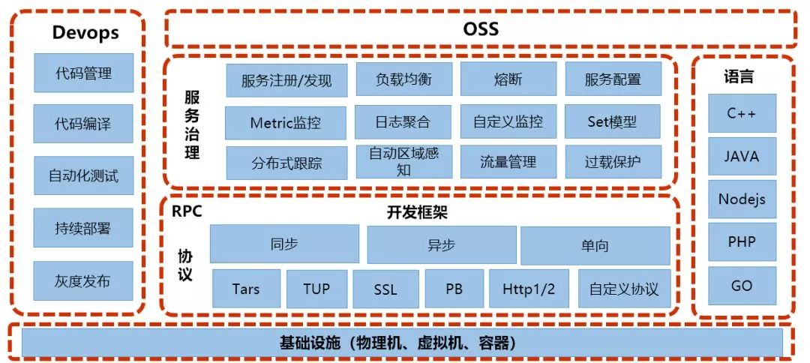

Registry

Registry 是微服务集群的管理和控制节点，提供服务注册和发现等功能。

服务节点

服务节点是 Tars 运行的原子单元，可以是一个容器也可以是一个虚机或物理机，一个业务服务通过部署多个服务节点来解决容量和容错问题。服务节点上包括一个 node 管理服务和一个或多个业务服务，node 服务对本节点的服务进行统一管理，提供启停、监控服务节点等功能，同时接收业务服务节点上报过来的心跳，上报给 Registry 作为服务发现的数据来源。

基础服务集群

基础服务集群是为解决微服务治理而设计的一系列服务，服务节点数量不定，为了自身的容错容灾，一般也要求在多个服务器上进行部署，具体的节点数量与业务规模有关，比如，如果业务规模大需要打较多的日志，就需要部署更多的日志服务节点。基础服务主要包括监控统计、配置中心、日志聚合、认证鉴权和分布式调用链等。Tars 具有非常完善的服务治理能力。

 

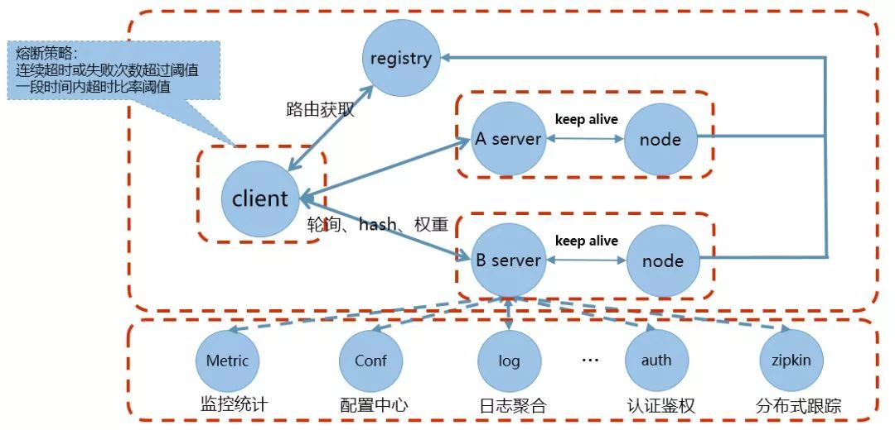

Tars 通过 Registry、服务节点和基础服务集群协同工作，透明完成服务发现/注册、负载均衡、鉴权、分布式跟踪等服务治理相关工作。如框架通过 Registry 来注册 xxxsvr，Client 通过访问 Registry 获取到被调服务的地址信息列表，Client 再根据需要选择合适的负载均衡方式来调用服务。负载均衡支持轮询、hash、权重等多种方式。

为了更及时地屏蔽故障节点，Client 根据调用被调服务的异常情况判断是否有故障来更快地进行故障屏蔽。具体策略是，当 Client 调用某个服务器出现调用连续超时超过设置阈值，或者调用的超时比率超过一定百分比阈值，Client 就会对此服务器节点进行屏蔽，让流量分发到正常的节点上去。对屏蔽的服务器节点，每隔一定时间进行重连，如果正常，则进行正常的流量分发。 

随着业务增长，服务的部署难免会跨机房或者地域，常规的负载均衡方式面对跨地区或者跨机房部署的服务会因为网络原因造成延时增大，为了加快服务间的访问速度，减少因建设跨地区、跨机房调用带来的网络资源消耗，减少网络故障带来的影响，Tars 提供自动区域感知的服务治理功能。

 

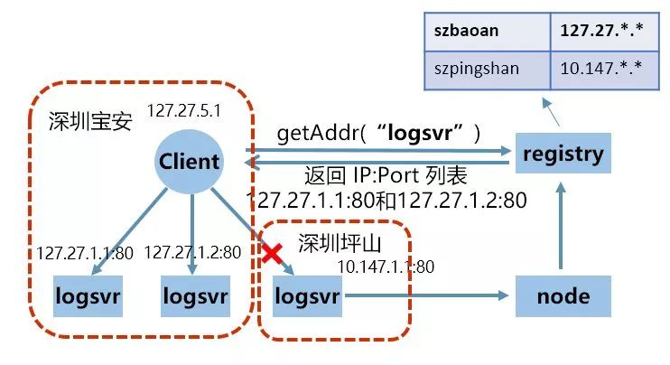

通过 Registry 和开发框架配合实现自动区域感知，这样的优势有：

◈ 运维简单

◈ 降低延时减少带宽消耗

◈ 更强的容灾能力

此外 Tars 还提供 Set 模型。

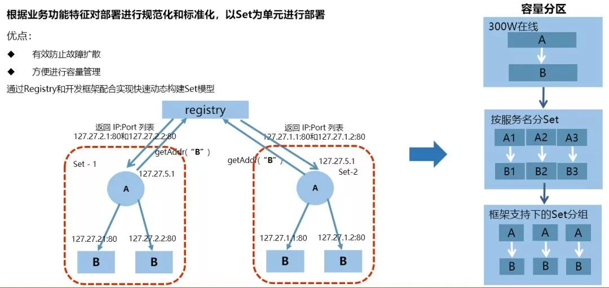

Set 模型是根据业务功能特征对部署进行规范化和标准化，以 Set 为单元进行部署。Set 模型的优点有：

◈ 有效防止故障扩散

◈ 方便进行容量管理 

对于流量控制，服务发布上线主要面对的问题是“如何做对业务无损的服务变更”与“如何做灰度验证”，在 Tars 中，可通过 Registry 和开发框架配合实现按需进行流量控制，达到无损发布和灰度流量的目的。

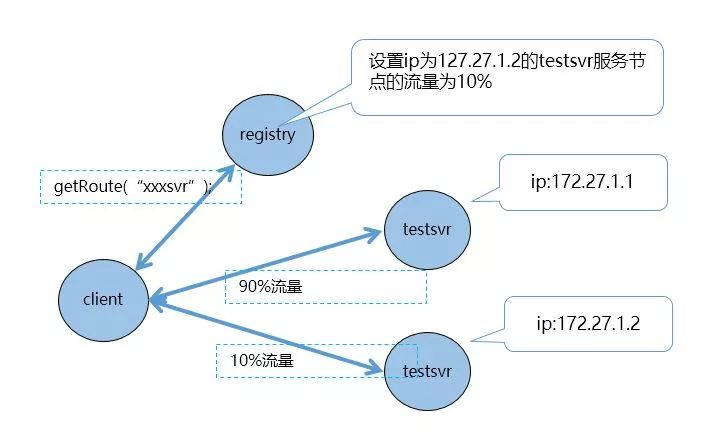

语言支持方面，除了此前已经支持的 PHP、C++、NodeJS 与 Java，此次还加入了 Golang 支持。 

此外，Tars 还提供一个 OSS 平台，可使运营可视化、Web 化。

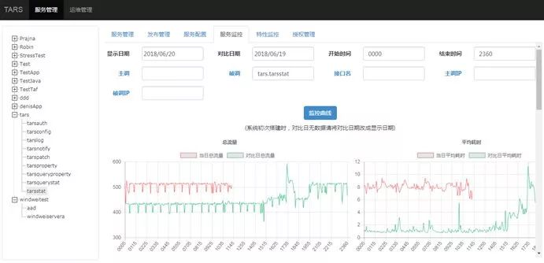

它主要包含以下特点：

◈ 业务管理：包括已部署的服务，以及服务管理、发布管理、服务配置、服务监控、特性监控等

◈ 运维管理：包括服务部署、扩容、模版管理等

◈ 提供 Open API ，可定制自己的 OSS 系统

Tars-Go，Tars Go！

多语言支持是 Tars 的一大优势，在此之前 Tars 已经推出了 C++、Java、PHP、NodeJS 版本。Go 语言的协程并发机制使它非常适用于大规模高并发后端服务器程序开发，同时随着容器化技术的飞速发展，诸如 Docker、Kubernetes 与 Etcd 等项目兴起，使得 Go 语言越来越流行，并成为云原生的首选语言。Tars 的 Go 语言版本也因此应运而生，此次 Tars-Go 的推出，在大环境整体逐渐走向云原生的当下，意义非凡。

Tars-Go 整体架构主要可以分为三个部分，如下图所示：

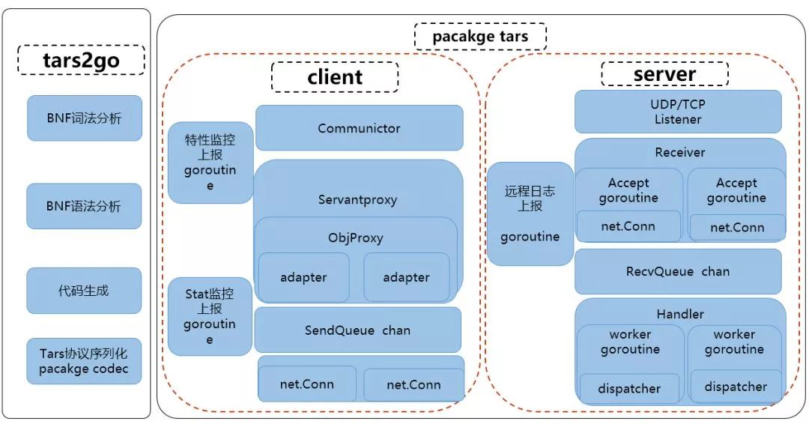

◈ 左边是 tars2go 工具，tars2go 基于巴科斯范式（BNF），这是一种描述程序语言结构的形式化方法，用来对 Tars 文件进行语法和词法分析，生成相应的代码，供客户端和服务端使用。同时它提供 Tars 协议二进制流的编解码功能，将二进制包转成相应的 Go 数据结构。

◈ 右边部分是 package tars，它包含了 Client 和 Server 两部分的功能：

◈ Client 由 Servantproxy、Communicator、ObjProxy、adapterproxy 等逻辑结构组成，这些逻辑结构用来管理 servant，obj 对应到的服务端节点的 ip 端口，和 C++ 的逻辑保持一致。底层使用 net.Conn 来建立具体的连接，并用 SendQueue chan 来控制并发数量。Client 还包含一些 Goroutine，用来做特性监控和 stat 监控上报。

◈ Server 使用 package net 的 listener 来管理 TCP 和 UDP 连接，使用多个 Goroutine 进行 accept，并将 accept 之后的 net.Conn 经过 SendQueue chan 交给后端的 Handler 进行处理。Handler 由一堆 woker Goroutine 组成，每个 Goroutine 基于 net.Conn 进行收发包、Tars 协议解码，并经过 dispatcher（由 tars2go 生成） 来调用用户的代码实现，然后将结果编码成二进制流返回给 Client。Server 也包含一些 Goroutine 实现远程日志异步上报等功能，防止同步调用阻塞请求。

Tars 开源团队在研发 Tars-Go 的过程中经历的对其各个方面的性能调优改造，Tars-Go 在早先的版本注重于功能的开发和完善，没有体系化地进行压测和性能分析。在业务使用一段时间后，开始注重性能优化。Tars 开源团队对 tars2go 工具先进行了一轮优化，在生成语树的时候生成好了类型信息，避免使用反射进行类型判断，编解码的效率提升了 2 倍，然后对再对整体 servant 进行了一轮轮压测，并进行 CPU profile 性能分析。

下面是性能提升优化的几个实例： 

Timer 性能问题

每个请求进来，Tars-Go 会创建一个协程进行处理，因为要处理调用超时，会创建一个 timer，在结束的时候会删掉 timer，当并发量一上来，就会频繁创建和删除 timer，占用服务大量 CPU 时间。

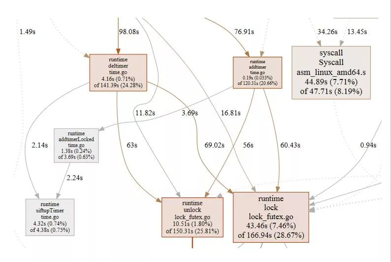

研发团队在一个 issue 中发现 ，在多 CPU 的场景下，如果存在大量的 timer，性能就会大量损耗，优化方式是每个 p 有自己的 timer，这样可以大幅提升整体并发性能。于是 Tars-Go 将编译环境升级至 1.10.3，从 profile 来看，性能得到了很大的提升，并且基于时间轮询算法实现了自己的 timer，以精度换取性能和效率。

net 包的 SetDeadline 调用性能问题

为了设置网络连接的读写超时，Tars-Go 使用了 net 包的 SetReadDeadline/SetWriteDeadline 等相关调用，但从 profile 发现，当并发非常大的时候，会导致这两个调用占用了大量的 CPU 时间。为了绕开这两个相关调用，使用了 Sysfd 进行 Socket 读写超时的设置。 

bytes 的 Buffer 带来的性能问题

从下图可以看出，有相当大的一部分时间耗在了 slice 相关的操作上，原来在包的编解码过程中，使用 bytes.Buffer 进行临时存放，当 bytes.Buffer 底层用的 byte slice 大小不够的时候，就会分配一定的内存空间，频繁地分配效率很低，所以导致大包情况下性能下降比较明显。

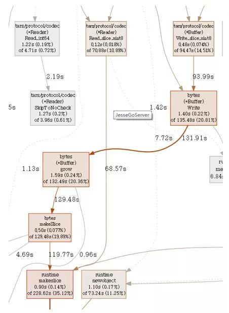

联想到了 Redis 的内存模型和 Linux 的 slab 机制，对于频繁创建销毁的对象，采用预先创建和重复利用的方式。而 Go 本身提供了一种 sync.Pool 机制，供临时对象的复用，以减少 GC，Tars-Go 在此基础上，实现了类似 Linux slab 机制分配的 buffer 管理方案，通过这种方案，性能大幅提高。

其他方面的优化

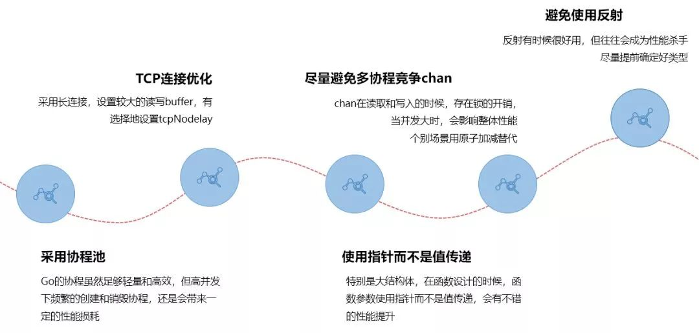

经过上面的性能优化后，Tars-Go 在小包的并发表现提升了 5 倍。

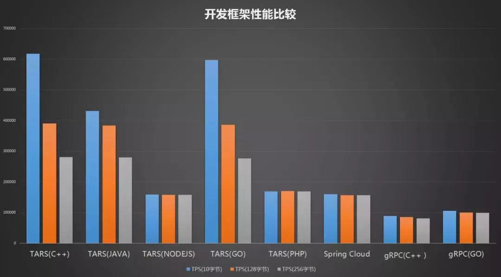

◈ 压测机型：4 核/8线程 CPU  3.3Ghz 主频 16G 内存

◈ 压测逻辑：客户端带着一定大小的数据给服务端，服务端原样返回给客户端

◈ 服务端单进程，多个客户端发起测试

Tars-Go 编程示例 

Tars 协议是一个二进制协议，它是与语言无关的IDL语言，由工具自动生成服务端和客户端代码，下边是一个 Tars 协议的示例：

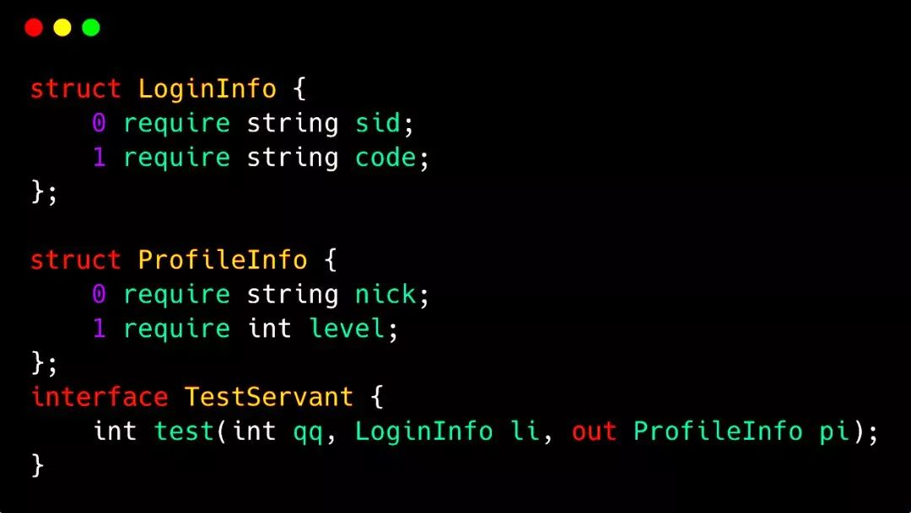

具体编程的时候，首先需要定义一个 Tars 文件，如下所示：定义接口 Mult ，a 和 b 为入参，c 为出参，均为整型。

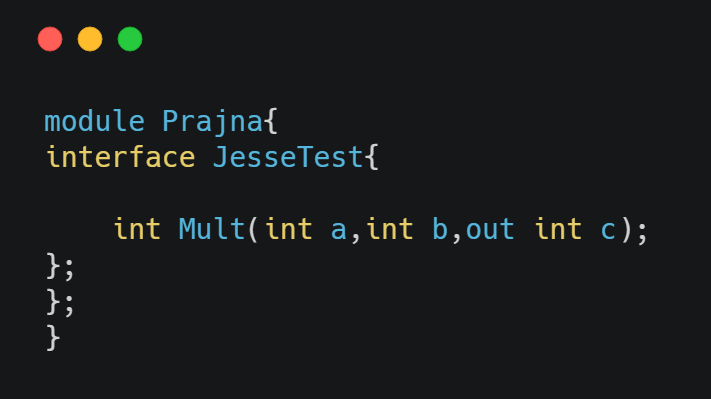

接着生成接口代码。使用 tars2go JesseTest.tars 即可自动生成 pacakge Prajna JesseTest 的 servant 和 Mult 方法的框架实现，业务无需关心实现细节：

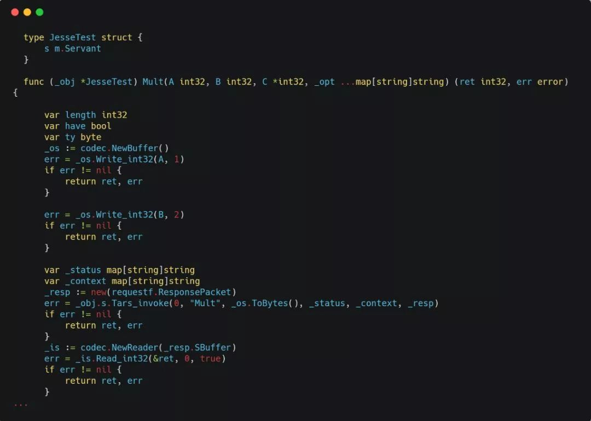

最后，实现接口代码，将入参 a、b相乘后的结果放到 c 返回给客户端：

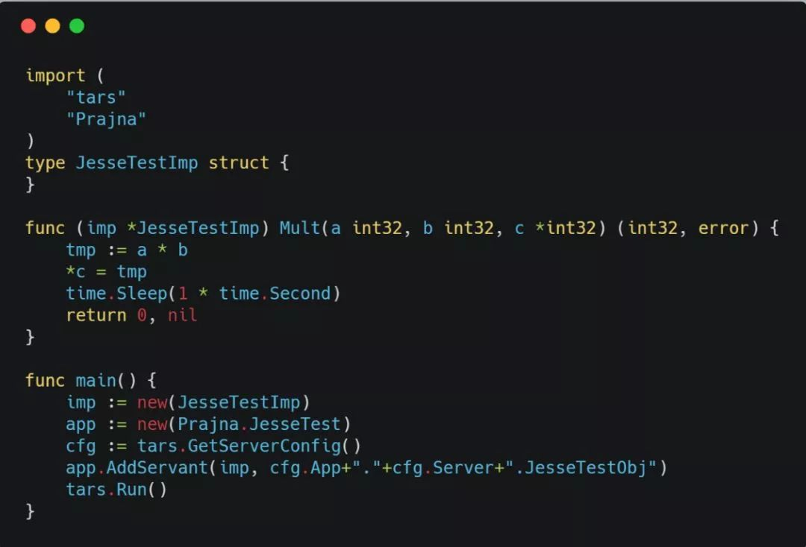

之后 go build 就可以进行编译。

而客户端只需关注出入参，引入由 Tars 文件转化成的包即可完成一次 RPC 调用。

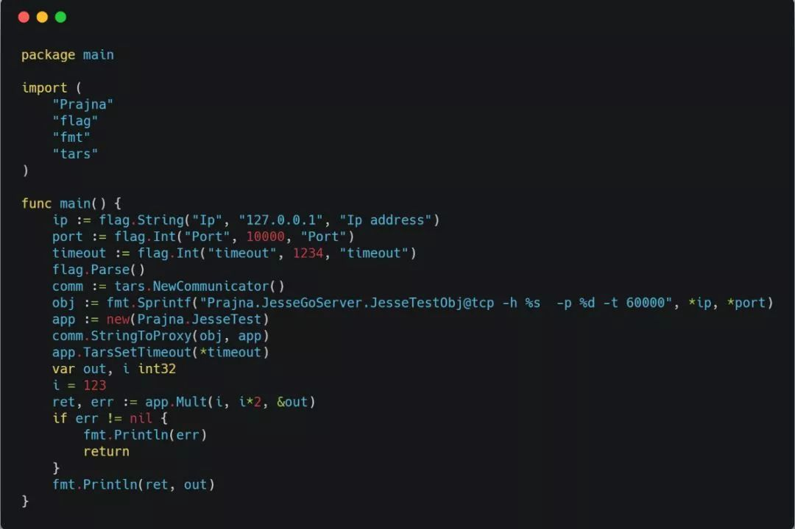