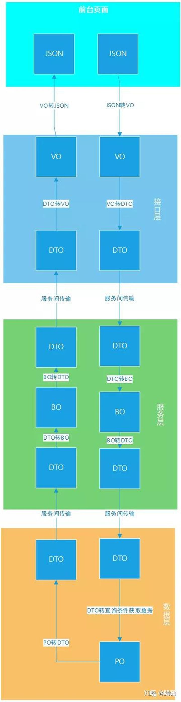

# 微服务篇-浅析VO、BO、 PO、 DTO

POJO的定义是无规则简单的对象，在日常的代码分层中POJO会被分为VO、BO、 PO、 DTO，这些分别是指哪里的对象呢？让我们一起研究下吧

**一、首先了解下VO、BO、 PO、 DTO是什么**

> VO （view object/value object）表示层对象
> 1、前端展示的数据，在接口数据返回给前端的时候需要转成VO
> 2、个人理解使用场景，接口层服务中，将DTO转成VO,返回给前台

> B0（bussines object）业务层对象
> 1、主要在服务内部使用的业务对象
> 2、可以包含多个对象，可以用于对象的聚合操作
> 3、个人理解使用场景，在服务层服务中，由DTO转成BO然后进行业务处理后，转成DTO返回到接口层

> PO（persistent object）持久对象
> 1、出现位置为数据库数据，用来存储数据库提取的数据
> 2、只存储数据，不包含数据操作
> 3、个人理解使用场景，在数据库层中，获取的数据库数据存储到PO中，然后转为DTO返回到服务层中

> DTO（Data Transfer Object）数据传输对象
> 1、在服务间的调用中，传输的数据对象
> 2、个人理解，DTO是可以存在于各层服务中（接口、服务、数据库等等）服务间的交互使用DTO来解耦

**二、了解他们的用法了，那么为什么要这么用呢？**

> 1、减少数据的传输量
> 2、保证数据库结构不外泄
> 3、使各层服务之间解耦

例如，用户信息包含：用户姓名name、用户密码password、用户的年龄age，首先数据库层获取PO数据包含这三个字段的数据，可是password不应该暴露出去，怎么做呢，在发送给服务层的时候做一次处理，转成只有name和password的DTO，这样就能减少出数据的传输，同时将name可以改为username,就可以保证数据库结构的安全。

怎么解耦呢，用户数据库结构改变了，把name改为displayName，po对象的字段也修改了，如果没有DTO做数据转换的话，所有使用po来存储用户信息的服务都要受到影响。

**三、具体各层中使用看图来直观了解下**

到这里基本已经弄明白了，POJO在各层中的使用，那么它们之间的转换工作也是一个很大的工作量啊，这个怎么解决呢。

我使用的是dozer + lombok来解决的，具体的使用情况会在篇文章中分享