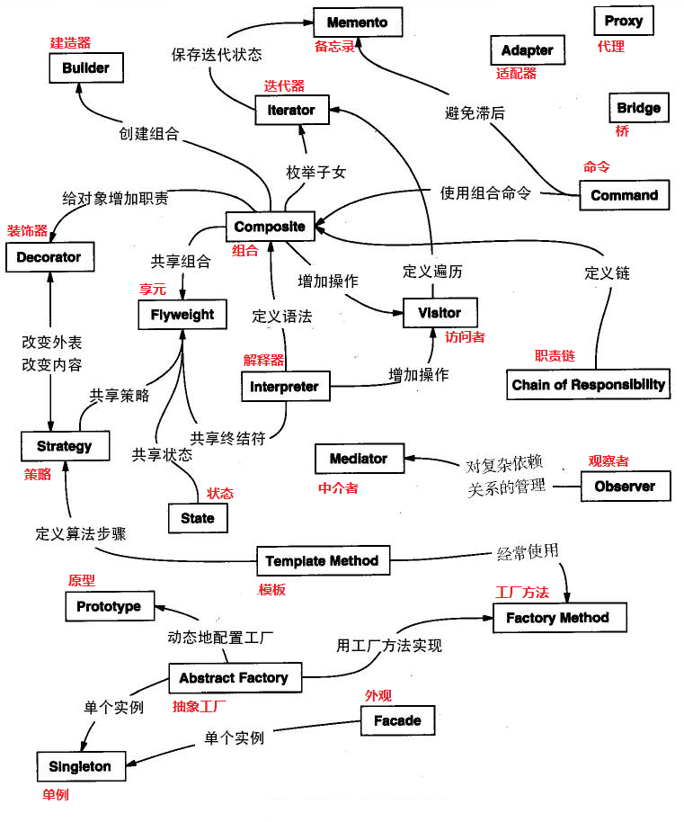

# 设计模式-总览

## 来源

在1994年，由Erich Gamma、Richard Helm、Ralph Johnson 和 John Vlissides 四人合著出版了一本名为 **Design Patterns - Elements of Reusable Object-Oriented Software**的书，这里就是设计模式的起源。

四位作者合成GOF（四人帮，Gang of Four），他们提出的设计模式主要基于面向对象设计原则。

> 对接口编程而不是对实现编程。
>
> 优先使用对象组合而不是继承。

## 7大基本原则

1. **开闭原则（OCP，Open Close Principle）**

   > 对扩展开放，对修改关闭。
   >
   > 在程序需要进行拓展的时候，不能去修改原有的代码，而是实现一个热插拔的效果。简言之，是为了使程序的扩展性好，易于维护和升级。想要达到这样的效果，我们需要使用**接口和抽象类**。

2. **单一职责原则（SRP，Single Responsibility Principle）**

   > 就一个类而言,应该仅有一个引起它变化的原因；
   >
   > 控制类的粒度、将对象解耦、提高内聚性；注重职责，主要约束类（实现和细节）；

3. **里氏替换原则（LSP，Liskov Substitution Principle）**

   > 任何基类可以出现的地方，子类一定可以出现。
   >
   > 阐述继承复用的原则；开闭原则实现方式；子类继承父类时，尽量不要重写父类方法；（不要破坏继承关系）

4. **依赖倒置原则（DIP，Dependence Inversion Principle）**

   > 接口不应依赖于实现，实现应该依赖于接口。
   >
   > 原则是开闭原则的基础，具体内容：针对接口编程，依赖于抽象而不依赖于具体。

5. **接口隔离原则（ISP，Interface Segregation Principle）**

   > 从子类实现角度，一个子类实现只需要实现哪些他需要的接口。
   >
   > 所以我们需要对接口进行分组，这样可以降低类之间的耦合度。

6. **迪米特法则（LoD， Law of Demeter）**

   > 一个实体应当尽量少地与其他实体之间发生相互作用，使得系统功能模块相对独立。

7. **合成复用原则（CRP，Composite Reuse Principle）**

   > 尽量使用合成/聚合的方式，而不是使用继承。

## 设计模型分类

**创建型**：描述对象如何创建，是为了将对象的创建与使用分离。

包括6种：单例、原型、简单工厂、工厂方法、抽象工厂、建造者。

**结构型**：描述类或对象如何组织成更大结构

包括7种：代理、适配器、桥接、装饰、外观、享元、组合。

**行为型**：描述类或对象之间如何协作完成任务

包括11种：模板方法、策略、命令、职责链、状态、观察者、中介者、迭代器、访问者、备忘录、解释器。

共24中设计模式，也由把简单工厂摘出来，为23中设计模式。

## 图解设计模式关系

