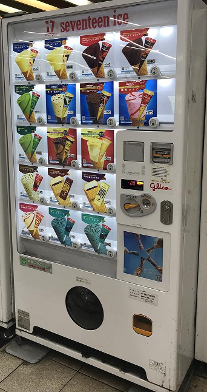
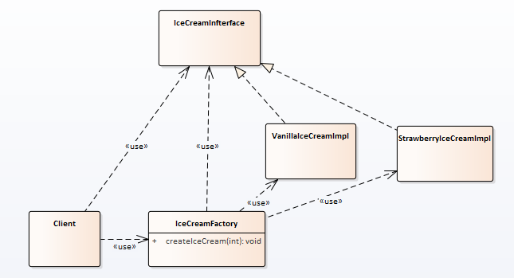

# 设计模式-简单工厂

选择简单工厂作为第一个篇，因为它几乎是最简单的设计模式。


## 场景背景

肯德基推出草莓冰淇淋（产品编号1）和香草冰淇淋（产品编号1），要卖给用户；代码如何实现？


## 场景分析

这里想一想我们的冰淇淋贩卖机器，客户不需要知道冰淇淋怎么生成，客户只需要按下对应的按钮即可得到他们想要的产品。

简单工厂就可以实现贩卖机的功能。




## 实现

实现类图为：



用户不用知道冰淇淋的生产过程；

用户只需要知道：

1. 要的是冰淇淋 （接口）

2. 冰淇淋的贩卖机在哪 （工厂）

3. 冰淇淋的产品列表 （一般会抽象为枚举类型)

   

### 代码

**冰淇淋接口和它的实现**

```c++
// 冰淇淋接口
class IceCreamInfterface
{
public:
    virtual ~IceCreamInfterface() {}
    virtual void taste() = 0;
};

// 草莓冰淇淋
class StrawberryIceCreamImpl : public IceCreamInfterface
{
public:
    virtual void taste() override
    {
        qDebug() << QStringLiteral("草莓冰淇淋的味道！");
    }
};

// 香草冰淇淋
class VanillaIceCreamImpl : public IceCreamInfterface
{
public:
    virtual void taste() override
    {
        qDebug() << QStringLiteral("香草冰淇淋的味道！");
    }
};
```


**冰淇淋工厂和产品列表**

```c++

// 冰淇淋工厂
class IceCreamFactory
{
public:
    // 产品列表
    enum ProductList
    {
        StrawberryIceCream,
        VanillaIceCream
    };

public:
    static IceCreamInfterface  createIceCream(ProductList productId)
    {
        IceCreamInfterface *pProduct = nullptr;
        switch (productId)
        {
        case StrawberryIceCream:
            pProduct = new StrawberryIceCreamImpl();
            break;
        case VanillaIceCream:
            pProduct = new VanillaIceCreamImpl();
            break;
        default:
            break;
        }
        return pProduct;
    }
};
```


**客户**

```c++

int main(int argc, char *argv[])
{
    // 买个草莓味的冰淇淋
    IceCreamInfterface *pIceCream1 =
            IceCreamFactory::createIceCream(IceCreamFactory::StrawberryIceCream);
    pIceCream1->taste();

    // 买个香草味的冰淇淋
    IceCreamInfterface *pIceCream2 =
            IceCreamFactory::createIceCream(IceCreamFactory::VanillaIceCream);
    pIceCream2->taste();

    delete pIceCream1;
    delete pIceCream2;
}
```


代码位置：

https://github.com/su-dd/Demo_DesignPattern/tree/main/SimpleFactory

## 总结

简单工厂作为创建型设计模式，主要作用也是将对象的创建与使用分离。

简单工厂使用的特点：

 	1. 产品是有限的、已知的。


如果面对的产品很多，或者已知后续会增加产品个数；那么简单工厂就不能很好的胜任这个工作。我可以在工厂方法中寻找答案。


