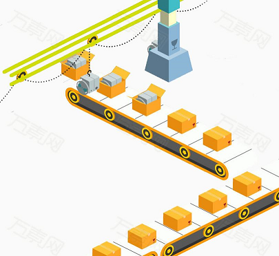

# 设计模式-工厂模式

上一篇已经描述了[简单工厂](https://github.com/su-dd/Documents/blob/master/%E8%AE%BE%E8%AE%A1%E6%A8%A1%E5%BC%8F/1.%E8%AE%BE%E8%AE%A1%E6%A8%A1%E5%BC%8F-%E7%AE%80%E5%8D%95%E5%B7%A5%E5%8E%82.md)的实现，并对特点和问题做了对比，如果感兴趣可以回去看。

## 场景背景

经过大家的努力，肯德基的草莓冰淇淋和香草冰淇淋销量不错。

准备继续贩售新的冰淇淋产品，发现每次生产新产品时，都要对之前的工厂（简单工厂）进行改造。

肯德基害怕会影响产品品质，希望设计一个发布新产品不会影响原产品生产的工厂。

代码如何实现？

## 场景分析

让我们再想一想冰淇淋工厂的流水线吧；如何再不影响一个流水线的情况下，再多出一种产品嗯？

**造一条新的流水线去生产新产品！**

程序就是好，造流水线没那么花钱。

## 实现

### 代码

## 使用感悟