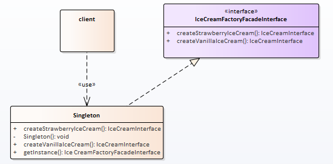

# 设计模型-单例模式

上篇了解了外观模式，解决了客户端找不到需要访问的功能的困扰。

## 场景描述

小卖部是挺好，但是啃得鸡就不干了；我研发的产品，你去买？ 那我怎么管理服务的标准化（统一提价）。

## 场景分析

小卖部虽好，但如果只有我能开，那就更好了！

## 实现

实现类图：

单例模式的思路比较简单，就是要求程序运行范围内只有一个对象。

为了这个目的，在不同情况下，需要使用不同的技术来辅助。

### 代码

## 使用感悟

