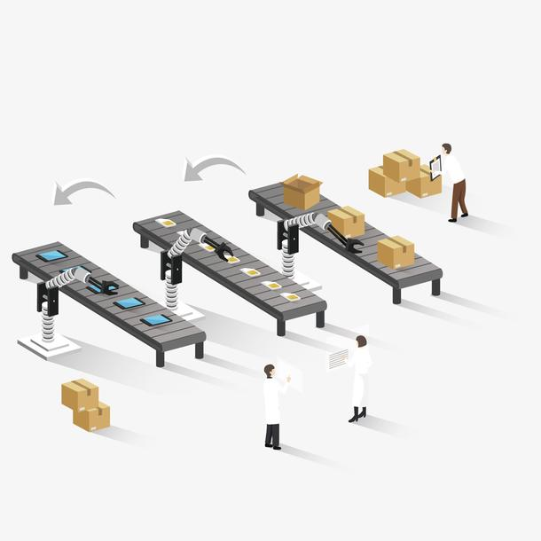
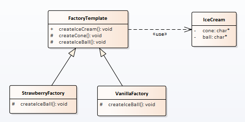

# 设计模式-模板方法

模板方法是一个你在下意识的情况下就会使用的方法。

模板方法的核心思想就是将流程中的细节（变化的地方）；下放到子类中解决。

## 场景描述

啃得鸡自从通过抽象工厂解决套餐模式后，流量大增；但暂时盈利达到了上限。于是希望节流，发现工厂流程很多重复项，希望可以通过统一生产流程来做到成本优化。

## 场景分析

简化场景，只生产冰淇淋甜筒。我们发现冰淇淋甜筒就是薄饼筒和冰淇淋球的组合。不同口味的冰淇淋，薄饼筒是不变的，换不同的冰淇淋球。

## 实现

### 类图

### 代码

模板方法：

子类：

Demo代码位置：

## 使用感悟

