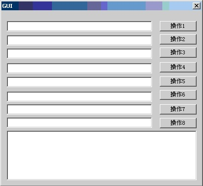

[TOC]

# 软件可测试性设计

[^undefined]: 2010-04-22 作者：张元礼 来源：张元礼的blog

## 1 概述

随着软件行业的迅猛发展，软件测试也逐渐受到越来越多的软件公司所重视，然而开发出来的软件直接就可以拿出来做测试吗？根据近几年来的实践证明，在设计软件时事先没有对软件的可测试性进行周密设计和部署的软件在测试时总是很难于进行，直到测试无法进行下去为止。被测软件在编码时需要考虑给测试和后期的产品维护提供必要的手段和接口支持，即要求软件具有可测试性。基于可测试性的目标考虑，良好的架构设计，完备的接口，使得软件测试更加高效和可行，同时产品维护也更加便利。

本文描述的范围：可测试性定义、可测试性特征、可测试性设计。

读者对象：系统分析和设计人员、开发人员、测试人员。

参考文献：

1.《软件可测试性需求设计》 Vince

2.《高质量C++/C编程指南》 林锐

3.《软件工程思想》 林锐

## 2 软件可测试性定义

### 2.1 可测试性定义

软件的可测试性是指在一定的时间和成本前提下，进行测试设计、测试执行以此来发现软件的问题，以及发现故障并隔离、定位其故障的能力特性。简单的说，软件的可测试性就是一个计算机程序能够被测试的容易程度。

一般来说可测试性很好的软件必然是一个强内聚、弱耦合、接口明确、意图明晰的软件，而不具可测试性的软件往往具有过强的耦合和混乱的逻辑。

### 2.2 可测试性特征

#### 1.可操作性：“运行得越好，被测试的效率越高。”

1)系统的错误很少；

2)没有阻碍测试执行的错误；

3)产品在功能阶段的演化(允许同时的开发和测试)。

#### 2.可观察性：“你所看见的就是你所测试的。”

1)每个输入有唯一的输出；

2)系统状态和变量可见，或在运行中可查询；

3)过去的系统状态和变量可见，或在运行中可查询(例如：事务日志)；

4)所有影响输出的因素都可见；

5)容易识别错误输出；

6)通过自测机制自动侦测内部错误；

7)自动报告内部错误；

8)可获取源代码。

#### 3.可控制性：“对软件的控制越好，测试越能够被自动执行与优化。”

1)所有可能的输出都产生于某种输入组合；

2)通过某种输入组合，所有的代码都可能被执行；

3)测试工程师可直接控制软件和硬件的状态及变量；

4)输入和输出格式保持一致且有结构；

5)能够便利地对测试进行说明、自动化和再生；

6)接口和模块易控制；

7)业务流程和场景易控制。

#### 4.可分解性：“通过控制测试范围，能够更快地分解问题，执行更灵巧的再测试。”

1)软件系统由独立模块构成；

2)能够独立测试各软件模块；

3)业务流程和场景易分解。

#### 5.简单性：“需要测试的内容越少，测试的速度越快。”

1)功能简单性(例如：特性集是满足需求所需的最小集合)；

2)结构简单性(例如：将体系结构模块化以限制错误的繁殖)；

3)代码简单性(例如：采用代码标准为检查和维护提供方便)。

#### 6.稳定性：“改变越少，对测试的破坏越小。”

1)软件的变化是不经常的；

2)软件的变化是可控制的；

3)软件的变化不影响已有的测试；

4)软件失效后能得到良好恢复和隔离。

#### 7.易理解性：“得到的信息越多，进行的测试越灵巧。”

1)设计能够被很好地理解并遵循行业规范；

2)内部、外部和共享构件之间的依赖性能够被很好地理解；

3)设计的改变被通知；

4)可随时获取技术文档；

5)技术文档组织合理；

6)技术文档明确详细；

7)技术文档精确性稳定；

8)相关环境配置说明与操作指导。

## 3软件可测试性设计

### 3.1可测试性设计

软件的可测试性特征主要表现是设立观察点、控制点、观察装置、驱动装置、隔离装置。需要注意的是可测试性设计时必须要保证不能对软件系统的任何功能有影响，不能产生附加的活动或者附加的测试，采取合适的设计模式对软件进行设计。

#### 1.坚持测试驱动设计（测试先行）的方法。

优先编写测试代码，这是标准的XP方法。不是说应该一次性编写全部测试代码后，再一次性全部实现。先写验收测试，再写单元测试，编写一些测试代码，实现它们，再编写一些测试代码，再实现它们等等是个更好的办法。设计以这种方式得以进展；在实现阶段捕捉错误并在下一组测试中改正它，以这种方式编写测试也更少会使人畏缩。

#### 2.尽量做到每个操作对应一个函数，使函数小型化。

使用小型函数说明和重载带缺省参数的函数将使在测试中调用这些函数变的愉快的多。否则，在测试这些函数时将不得不构造额外参数，如果参数很大，那么将很快导致代码膨胀。更糟的是，它会诱使你编写比在其它情况下更少的测试。

#### 3.数据的显示与控制分离

把代码移到 GUI 视图的外面。然后各种 GUI 动作就能成了模型上的简单方法调用。这样，对GUI测试者来说，通过方法调用测试功能比间接地测试功能容易的多。另一个好处是它使修改程序功能而不影响视图变的更容易。

#### 4.可控制性设计

**1)全局变量的可控制性设计** 

I.在外界使用适当的手段能够直接或间接控制该变量,包括获取、修改变量值等；

II. 可以将全局类型的变量进行分类并封装到一个个接口中操作。

**2)接口的可控制性设计** 

各接口在外界使用适当的手段能够直接调用对该接口进行操作,这里所谓的适当的手段主要包括使用测试工具和增加额外代码. 对于向外提供的接口的接洽处能够人为的对接，比如构造测试环境模拟接口对接，这里所指的开放接口主要是指相对于整个被测系统，即为被测系统以外提供的接口。接口接洽处人为对接时各接口所要求的条件和所需的参数人为的能够轻易达到和提供。

**3)模块的可控制性设计** 

对于每个相对独立的模块设计好所需要的驱动和桩都能单独设计用例进行测试对应的功能，在测试运行期间模块异常时能够将其隔离而不影响测试。

**4)业务流程的可控制性设计** 

在测试环境满足的情况下能够控制任一单独业务流程，各业务流程具有流通性。

**5)场景的可测试性设计** 

将一场景所涉及到的业务和接口整合到一个统一的接口使其能够单独操作该场景。

#### 5.可分解性设计

**1)业务流程的可分解性设计** 

对于复杂的业务流程需合理设定分解点，在测试时能够对其进行分解。

**2)场景的可分解性设计** 

对于复杂的场景需合理设定分解点，在测试时能够对其进行分解。

#### 6.稳定性设计

测试模块发布合理，不能在后期追加的模块为前期所测模块引入新的不必要的测试活动。

#### 7.易理解性设计

**1)设计文档的易理解性** 

I.设计参考标准

II.内容描述主次要分清

III.依赖关系描述明确

**2)接口的易理解性** 

I.接口功能明确

II.参数有意义

**3)业务的易理解性** 

**4)场景的易理解性** 

#### 8.可观察性设计

1)业务执行状态和过程可观察性设计

2)异常情况可观察性设计

#### 9.测试驱动和桩的设置

为单个测试接口、测试业务、测试场景预留测试驱动和桩的接入点。

#### 10.适合增量式开发的可测试性设计

在增量式开发过程中必须优先考虑测试桩和测试驱动实现的难易程度和真实性。

#### 11.可查询设计

1)对系统级别的全局变量或者状态设置查询接口；

2)某一业务或场景调用接口设置接口路径查询

#### 12.自愈合功能

在某一场景中的局部出现故障时设置多路选择或者其他干涉进行跳转执行气候的具有正常逻辑的功能。

#### 13. 输出结果

对于任何一项操作都要能产生预期的输出,不管是正确的还是错误的甚至是异常的.测试结果的表现形式可以是数据、现象等，不管是以什么方式表现，都要有依可寻，在设计文档中要有说明。对于测试结果易于判断,具有可分析性、可获得性.在设置的各个控制点或观察点的结果易于查询、修改等。

#### 14.提供统一的操作执行面板

操作面板元素主要由输入和输出元素组成，如所执行的操作和对应的输出，但可能被测系统是一个比较复杂的系统，由多个可以独立的模块组成，涉及到的操作和输出比较多，各操作之间的关联也比较复杂。在设计时统一的做一个操作面板，该操作面板成为一个可以操作整个被测系统的独立模块，一种是以命令的形式执行操作，直接以printf语句的形式输出查看，另一种是以GUI的形式，输入（执行的操作）输出均在界面上执行和体现，这样比较直观。如下图所示：

特别对于执行某一场景时要跟踪该场景的关键过程和执行后的输出参数，给出一系列可以分析的数据，该场景可以以执行过程分阶段监控，将监控范围内的数据输出以供测试人员分析。

### 3.2 可测试性编码

1.注释需要详尽。特别对于接口，要描述清楚功能、实现及参数；

2.使用模块化方法，编码低耦合、高内聚；

3.为集成测试与系统联调准备调测开关及相应打印函数，并且要有详细的说明；

4.为单元测试选择恰当的测试点，并仔细构造测试代码、测试用例，同时给出明确的注释说明。测试代码部分应作为（模块中的）一个子模块，以方便测试代码在模块中的安装与拆卸（通过调测开关）；

5.使用断言来发现软件问题，提高代码可测试性；

6.用断言来检查程序正常运行时不应发生但在调测时有可能发生的非法情况；

7.为测试自动化工具提供所需要的特定“钩子（hook）”；

8.对于每个功能，提供访问、修改“状态”变量的接口，包括提供查询、修改上层软件、软硬件接口、底层硬件状态的接口及打印；

9.提供查询系统状态的接口。比如内存使用、程序使用进程数等；

10.对于测试因为环境等因素而可能无法测试的功能，提供接口模拟软件实现该功能的过程；

11.对于修改功能，提供修改功能参数单位的接口，以便于进行如软件性能等的测试；

12.出错及异常处理保存记录，记录具有详细的属性，并且格式统一、意义明确；

13.在程序异常时，除了保留日志，还需要提供观察、恢复的外部方法；

14.对全局变量、特殊结构，提供查询的方法。

### 3.3 可测试性调试与定位

1.对于程序中所涉及到的变量尽可能的在调试过程中可以查询及修改；

2.在整个软件系统执行过程中为每个关键业务或相对独立的业务设定一个调试点，便于系统集成和问题范围的定位；

3.在设定好的调试点处对处理的业务输出数据和全局数据进行可视化输出，便于测试结果的分析。

### 3.4 测试所需文档

1.需求规格说明书

2.概要设计说明书

3.详细设计说明书

4.系统功能清单

5.系统运行环境搭建指导书

6.系统操作指导书

http://www.uml.org.cn/zjjs/201004222.asp